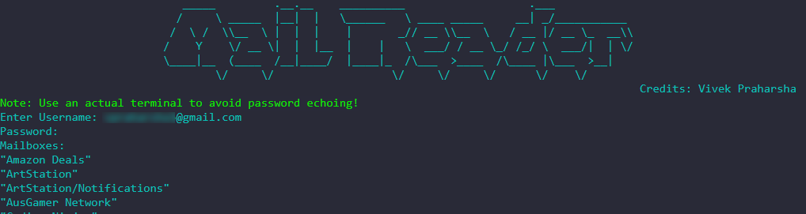
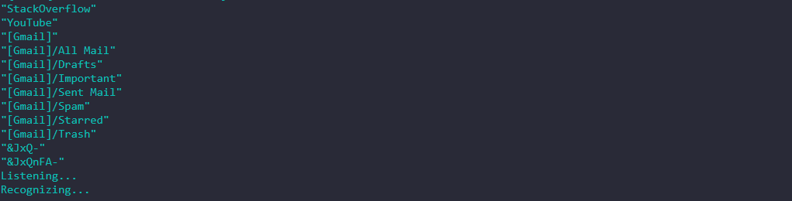
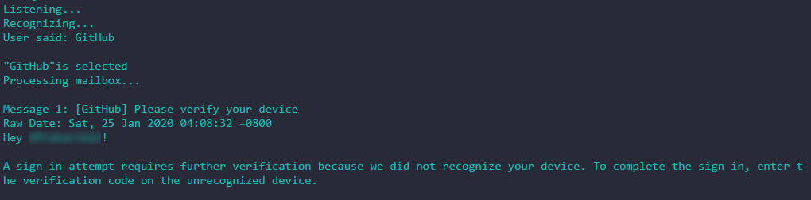
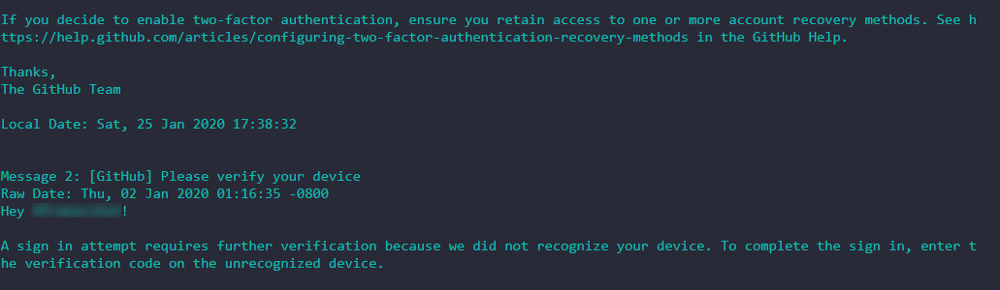

# Voice Assisted Mail Fetcher For Gmail
Fetch and Display mails from a label/mailbox using voice. Based on IMAP email protocol and Google Web Speech API 
written in Python.

## Prerequisites
The following Python modules (available via pip):
* [fuzzywuzzy](https://pypi.org/project/fuzzywuzzy/)
* [SpeechRecognition](https://pypi.org/project/SpeechRecognition/)
* [pyttsx3](https://pyttsx3.readthedocs.io/en/latest/)
* [BeautifulSoup](https://www.crummy.com/software/BeautifulSoup/)
* [html5lib](https://html5lib.readthedocs.io/en/latest/)

* [Get the relevant PyAudio wheel package for your Python3 version](https://www.lfd.uci.edu/~gohlke/pythonlibs/#pyaudio)
* [Get the relevant Python Levenshtein wheel for your Python3 version](https://www.lfd.uci.edu/~gohlke/pythonlibs/#python-levenshtein)

## Instructions:
* Enable IMAP for Gmail account
* Allow Less Secure Apps in Gmail
* requirements.txt is included, use ``pip install -r requirements.txt``

## Screenshots:
**User Authentication:**

**List out mailboxes/labels:**

**Selecting mailbox (Voice input)**

**Fetch and display all messages from selected mailbox/label:**

## Acknowledgments
Thanks for the suggestion [@eivl](https://github.com/eivl)

## Refer
[Check Out Search Keys](https://tools.ietf.org/html/rfc3501.html#section-6.4.4) to filter mail search 
